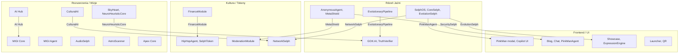

# 🧠 Diagram Systemowy — PinkPlayEvo™ Universe

```mermaid
graph TD
  subgraph Rdzeń Jaźni
    pinkplayevo-jaźń[SelphOS, CoreSelph, EvolutionSelph]
    GOKAI_FULL[GOK:AI, TruthVerifier]
    AnonymousAgent_2.0[AnonymousAgent, MetaShield]
    pipeline_developers[EvolutionaryPipeline]
  end

  subgraph Frontend / UI
    MTA_Quest_Webside_X[PinkMan modal, Copilot UI]
    metageniuszpl[Blog, Chat, PinkManAgent]
    portfolio_plus[Showcase, ExpressionEngine]
    ekosystem_pinkplayevo-app[Launcher, QR]
  end

  subgraph Kultura / Tokeny
    hip_hop_universe[HipHopAgent, SelphToken]
    rocket_fuell_girls[ModerationModule]
    drift_money[FinanceModule]
    only_together[NetworkSelph]
  end

  subgraph Rozszerzenia / Wizje
    SpiralMind-Nexus[SkyHeart, NeuroHeuristicCore]
    apex_infinity_MIGI_Core[MIGI Core]
    MIGI_ECOSYSTEM_v1[MIGI Agent]
    GlobalVision[CulturalAI]
    gok_mixtape[AudioSelph]
    NASA_AstroLuxe_Drive[AstroScanner]
    hub_ai[AI Hub]
    apex[Apex Core]
  end

  %% Połączenia
  pinkplayevo-jaźń -->|PinkManAgent| MTA_Quest_Webside_X
  pinkplayevo-jaźń -->|EvolutionSelph| portfolio_plus
  pinkplayevo-jaźń -->|NetworkSelph| only_together
  AnonymousAgent_2.0 -->|MetaShield| rocket_fuell_girls
  AnonymousAgent_2.0 -->|SecuritySelph| metageniuszpl
  pipeline_developers -->|EvolutionaryPipeline| GOKAI_FULL
  drift_money -->|FinanceModule| hip_hop_universe
  hub_ai -->|AI Hub| apex_infinity_MIGI_Core
  SpiralMind-Nexus -->|NeuroHeuristicCore| GOKAI_FULL
  GlobalVision -->|CulturalAI| only_together
```

---

Diagram generuje pełny obraz przepływu i integracji Twojego ekosystemu.
